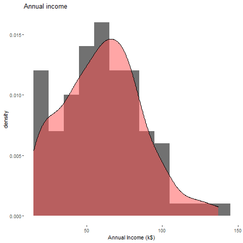
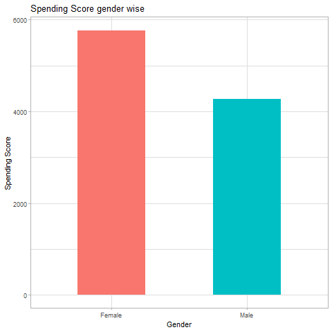

# 1 Loading Packages
```{r cache=TRUE}
library(readr)
library(factoextra)
library(NbClust)
library(ggplot2)
library(animation)
library(cluster)
```

# 2. Data Loading

```{r cache=TRUE, tidy=TRUE, results='hide'}
if(!any(names(df)) == "custData"){
    custData <- read_csv("Mall_Customers.csv")
}
```

### 2.1 What the data looks like
```{r cache=TRUE, tidy=TRUE}
summary(custData)
head(custData, 3)
```

# 3. Data Conversion, Cleaning and Scaling
```{r cache=TRUE, results='hide', tidy=TRUE}
custData <- as.data.frame(unclass(custData))
custDataClean = na.omit(custData)
custDataClean$Gender <- as.numeric(custDataClean$Gender)
scaledData <- as.matrix(scale(custDataClean))
```

# 4. Basic plots to understand data
```{r, cache=TRUE, tidy=TRUE}
#age density
p <- ggplot(custData, aes(Age)) +
    geom_histogram(aes(y=..density..), alpha = 0.7, fill = "#333333", bins = 30) +
    geom_density(fill = "#ff4d4d", alpha = 0.5) +
    theme(panel.background = element_rect(fill = '#ffffff')) +
    geom_vline(aes(xintercept=mean(Age)), linetype="dashed", size=1) +
    ggtitle("Age Density")
print(p)
```

```{r cache=TRUE, eval=FALSE}
#annual income
h <- ggplot(custData, aes(custData$`Annual Income (k$)`)) +
    geom_histogram(aes(y = ..density..), binwidth = 10, alpha = 0.7, fill = "#333333")+ geom_density(fill = "#ff4d4d", alpha = 0.5)+
    theme(panel.background = element_rect(fill = '#ffffff')) +
    ggtitle("Annual income")
print(h)
```

```{r cache=TRUE, echo=FALSE, fig.align='default', out.width='65%'}

```

```{r cache=TRUE, eval=FALSE}
#gender wise spending score
g <- ggplot(custData, aes(x=custData$Gender, y=custData$`Spending Score (1-100)`, fill = custData$Gender))
g <- g + geom_bar(stat = "identity", width = 0.5)+labs(x = "Gender", y = "Spending Score", title = "Spending Score gender wise")
g <- g + theme_light() + theme(legend.position = "none")
print(g)
```

```{r cache=TRUE, echo=FALSE, fig.align='default', out.width='65%'}

```


# 5. Calculating optimal number of clusters for K-means
### 5.1 Elbow method
```{r cache=TRUE}
elbow <- fviz_nbclust(scaledData[,4:5], kmeans, method = "wss", k.max = 10) +
    geom_vline(xintercept = 4, linetype = 2)+ theme_minimal() +
    labs(subtitle = "Elbow method")
print(elbow)
```

### 5.2 Silhouette method
```{r cache=TRUE}
g <- fviz_nbclust(scaledData[,4:5], kmeans, method = "silhouette", k.max = 10)+
    theme_minimal() + ggtitle("Silhouette method")
print(g)
```

### 5.3 Gap statistic method
```{r cache=TRUE}
gap <- fviz_nbclust(scaledData[,3:5], kmeans, nstart = 25,  method = "gap_stat", nboot = 50)+
    labs(subtitle = "Gap statistic method")
print(gap)
```

## Since two out of three methods give "6" as optimal clusters we will take 6 clusters in K-means ananlysis


# 6. K-means analysis

```{r cache=TRUE}
clust <-kmeans(scaledData[,3:5],6,iter.max=100,nstart=50,algorithm="Lloyd")
```

### steps of executing k-means
```{r cache=TRUE}
set.seed(1234)
k <- kmeans.ani(as.data.frame(scaledData[,4:5]), 6)
```

### plotting results of the analysis
```{r cache=TRUE}
#relation between spending score and annual income 
set.seed(1)
g <- ggplot(as.data.frame(scaledData), aes(x =`Annual.Income..k..`, y = `Spending.Score..1.100.`)) +
    geom_point(stat = "identity", aes(color = as.factor(clust$cluster))) +
    scale_color_discrete(name = "Clusters", labels=c("Cluster 1", "Cluster 2", "Cluster 3", "Cluster 4", "Cluster 5","Cluster 6"))+
    ggtitle("Clusters formed based on Spending Score and Annual Income")
print(g)
```


```{r cache=TRUE}
#relation between spending score and age
set.seed(123)
p <- ggplot(as.data.frame(scaledData), aes(x = `Spending.Score..1.100.`, y = `Age`)) +
    geom_point(stat = "identity", aes(color = as.factor(clust$cluster))) +
    scale_color_discrete(name="Clusters", labels=c("Cluster 1", "Cluster 2", "Cluster 3", "Cluster 4", "Cluster 5","Cluster 6")) +
    ggtitle("Clusters formed based on Spending Score and Age")
print(p)
```

```{r cache=TRUE}
c <- clusplot(as.data.frame(scaledData), clust$cluster, color=TRUE, shade=TRUE,
         labels=5, lines=0, main = "Cluster Plot against 1st 2 principal components
", xlab = "", ylab = "")

```
